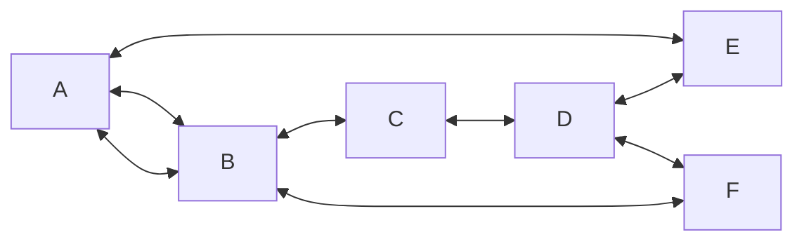
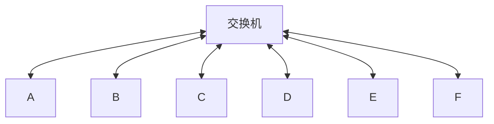

## 意图

**中介者模式**是一种行为设计模式， 能让你减少对象之间混乱无序的依赖关系。 该模式会限制对象之间的直接交互， 迫使它们通过一个中介者对象进行合作。

假定一组对象存在依赖关系,如果每个对象显式的存储另外几个对象的引用，那么对象的依赖关系就会变得杂乱无章

如果我们引入一个交换机作为他们之间通信的中介者那么他们之间的耦合就能变得松散


## 类图
```mermaid
classDiagram
class Mediator
&lt;&lt;inteface&gt;&gt; Mediator
class Colleague
&lt;&lt;abstract&gt;&gt; Colleague

Mediator <-- Colleague :mediator

ConcreteMediator ..|> Mediator
ConcreteColleagueA --|> Colleague
ConcreteColleagueB --|> Colleague
ConcreteMediator --> ConcreteColleagueA
ConcreteMediator --> ConcreteColleagueB
```


- 同事 （Colleague） 是各种包含业务逻辑的类。 每个组件都有一个指向中介者的引用， 该引用被声明为中介者接口类型。 组件不知道中介者实际所属的类， 因此你可通过将其连接到不同的中介者以使其能在其他程序中复用。

- 中介者 （Mediator） 接口声明了与组件交流的方法， 但通常仅包括一个通知方法。 组件可将任意上下文 （包括自己的对象） 作为该方法的参数， 只有这样接收组件和发送者类之间才不会耦合。

- 具体中介者 （Concrete Mediator） 封装了多种组件间的关系。 具体中介者通常会保存所有组件的引用并对其进行管理， 甚至有时会对其生命周期进行管理。

- 组件并不知道其他组件的情况。 如果组件内发生了重要事件， 它只能通知中介者。 中介者收到通知后能轻易地确定发送者， 这或许已足以判断接下来需要触发的组件了。

- 对于组件来说， 中介者看上去完全就是一个黑箱。 发送者不知道最终会由谁来处理自己的请求， 接收者也不知道最初是谁发出了请求。

## c++实现
```cpp
#include <iostream>
#include <string>
using namespace std;

typedef string Request;

class Colleague;

class Mediator {
public:
  virtual void notify(Colleague *sender, Request request) = 0;
};

class Colleague {
public:
  Colleague(Mediator *mediator = nullptr) : mediator(mediator) {}
  void set_mediator(Mediator *mediator) { this->mediator = mediator; }

protected:
  Mediator *mediator;
};

class Counter : public Colleague {
public:
  Counter(Mediator *mediator = nullptr) : Colleague(mediator) {}
  void order_dishes() {
    cout << "Counter: Order dishes" << endl;
    cout << "Counter: Send request to the kitchen" << endl;
    if (mediator != nullptr) {
      mediator->notify(this, "pass the order to the kitchen");
    }
  }
};

class Cook : public Colleague {
public:
  Cook(Mediator *mediator = nullptr) : Colleague(mediator) {}
  void cook_dishes() {
    cout << "Cook: Cooking dishes" << endl;
    cout << "Cook: Dishes are ready" << endl;
    if (mediator != nullptr) {
      mediator->notify(this, "dishes are ready");
    }
  }
};

class Waiter : public Colleague {
public:
  Waiter(Mediator *mediator = nullptr) : Colleague(mediator) {}
  void serve_dishes() {
    cout << "Waiter: Serve dishes" << endl;
    cout << "Waiter: Send request to the consumer" << endl;
    if (mediator != nullptr) {
      mediator->notify(this, "pass the order to the consumer");
    }
  }
};

class Consumer : public Colleague {
public:
  Consumer(Mediator *mediator = nullptr) : Colleague(mediator) {}
  void eat_dishes() {
    cout << "Consumer: Eat dishes" << endl;
    cout << "Consumer: The dishes are good!" << endl;
  }
};

class Scheduler : public Mediator {
private:
  Counter *counter;
  Cook *cook;
  Waiter *waiter;
  Consumer *consumer;

public:
  Scheduler(Counter *counter, Cook *cook, Waiter *waiter, Consumer *consumer)
      : counter(counter), cook(cook), waiter(waiter), consumer(consumer) {
    counter->set_mediator(this);
    cook->set_mediator(this);
    waiter->set_mediator(this);
    consumer->set_mediator(this);
  }

  void notify(Colleague *sender, Request request) override {
    if (request == "pass the order to the kitchen") {
      cook->cook_dishes();
    } else if (request == "dishes are ready") {
      waiter->serve_dWishes();
    } else if (request == "pass the order to the consumer") {
      consumer->eat_dishes();
    }
  }
};

void client() {
  Counter *counter = new Counter();
  Cook *cook = new Cook();
  Waiter *waiter = new Waiter();
  Consumer *consumer = new Consumer();
  Scheduler *scheduler = new Scheduler(counter, cook, waiter, consumer);
  counter->order_dishes();
}

int main() {
  client();
  return 0;
}
```

## 适用性
当一些对象和其他对象紧密耦合以致难以对其进行修改时， 可使用中介者模式。

该模式让你将对象间的所有关系抽取成为一个单独的类， 以使对于特定组件的修改工作独立于其他组件。

当组件因过于依赖其他组件而无法在不同应用中复用时， 可使用中介者模式。

应用中介者模式后， 每个组件不再知晓其他组件的情况。 尽管这些组件无法直接交流， 但它们仍可通过中介者对象进行间接交流。 如果你希望在不同应用中复用一个组件， 则需要为其提供一个新的中介者类。

如果为了能在不同情景下复用一些基本行为， 导致你需要被迫创建大量组件子类时， 可使用中介者模式。

由于所有组件间关系都被包含在中介者中， 因此你无需修改组件就能方便地新建中介者类以定义新的组件合作方式。

## 效果
- 单一职责原则。 你可以将多个组件间的交流抽取到同一位置， 使其更易于理解和维护。
- 开闭原则。 你无需修改实际组件就能增加新的中介者。
- 你可以减轻应用中多个组件间的耦合情况。
- 你可以更方便地复用各个组件。

- 一段时间后， 中介者可能会演化成为上帝对象。

## 与其他模式的关系

-   责任链模式用于处理请求发送者和接收者之间的不同连接方式：
    
    -   责任链按照顺序将请求动态传递给一系列的潜在接收者， 直至其中一名接收者对请求进行处理。
    -   命令在发送者和请求者之间建立单向连接。
    -   中介者清除了发送者和请求者之间的直接连接， 强制它们通过一个中介对象进行间接沟通。
    -   观察者允许接收者动态地订阅或取消接收请求。
-   外观模式的职责类似： 它们都尝试在大量紧密耦合的类中组织起合作。
    
    -   外观为子系统中的所有对象定义了一个简单接口， 但是它不提供任何新功能。 子系统本身不会意识到外观的存在。 子系统中的对象可以直接进行交流。
    -   中介者将系统中组件的沟通行为中心化。 各组件只知道中介者对象， 无法直接相互交流。
-  中介者和观察者之间的区别往往很难记住。 在大部分情况下， 你可以使用其中一种模式， 而有时可以同时使用。 让我们来看看如何做到这一点。
    
    中介者的主要目标是消除一系列系统组件之间的相互依赖。 这些组件将依赖于同一个中介者对象。 观察者的目标是在对象之间建立动态的单向连接， 使得部分对象可作为其他对象的附属发挥作用。
    
    有一种流行的中介者模式实现方式依赖于观察者。 中介者对象担当发布者的角色， 其他组件则作为订阅者， 可以订阅中介者的事件或取消订阅。 当中介者以这种方式实现时， 它可能看上去与观察者非常相似。
    
    当你感到疑惑时， 记住可以采用其他方式来实现中介者。 例如， 你可永久性地将所有组件链接到同一个中介者对象。 这种实现方式和观察者并不相同， 但这仍是一种中介者模式。
    
    假设有一个程序， 其所有的组件都变成了发布者， 它们之间可以相互建立动态连接。 这样程序中就没有中心化的中介者对象， 而只有一些分布式的观察者。