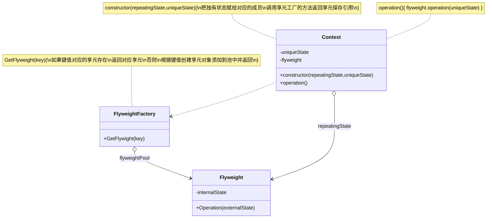
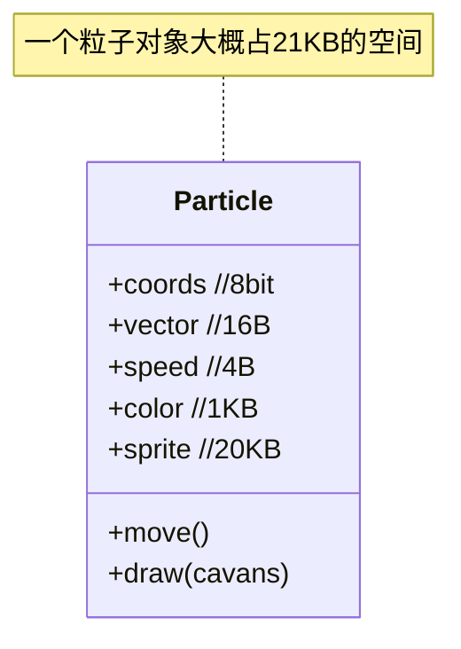

## 定义
运用共享技术有效的支持大量细粒度的对象。

所谓享元，顾名思义就是被共享的单元。享元模式的意图是复用对象，节省内存，前提是享元对象是不可变对象。

当一个系统中存在大量重复对象的时候，如果这些重复的对象是不可变对象，我们就可以利用享元模式将对象设计成享元，在内存中只保留一份实例，供多处代码引用。这样可以减少内存中对象的数量，起到节省内存的目的

## 类图

## 例子
假定你开发了一款游戏实现一个真实的粒子系统， 并将其作为游戏的特色。 大量的子弹、 导弹和爆炸弹片会在整个地图上穿行， 为玩家提供紧张刺激的游戏体验。假定粒子类是这样的

假定有`1_000_000`个子弹实例，那么一共要消耗`21GB`的存储空间

仔细观察Particle类， 你可能会注意到颜色 （color） 和精灵图 （sprite） 这两个成员变量所消耗的内存要比其他变量多得多。 更糟糕的是， 对于所有的粒子来说， 这两个成员变量所存储的数据几乎完全一样 （比如所有子弹的颜色和精灵图都一样）。

每个粒子的另一些状态 （坐标、 移动矢量和速度） 则是不同的。 因为这些成员变量的数值会不断变化。 这些数据代表粒子在存续期间不断变化的情景， 但每个粒子的颜色和精灵图则会保持不变。

对象的常量数据通常被称为**内在状态**， 其位于对象中， 其他对象只能读取但不能修改其数值。 而对象的其他状态常常能被其他对象 “从外部” 改变， 因此被称为**外在状态**。

享元模式建议不在对象中存储外在状态， 而是将其传递给依赖于它的一个特殊方法。 程序只在对象中保存内在状态， 以方便在不同情景下重用。 这些对象的区别仅在于其内在状态 （与外在状态相比， 内在状态的变体要少很多）， 因此你所需的对象数量会大大削减。

让我们回到游戏中。 假如能从粒子类中抽出外在状态， 那么我们只需三个不同的对象 （子弹、 导弹和弹片） 就能表示游戏中的所有粒子。 你现在很可能已经猜到了， 我们将这样一个仅存储内在状态的对象称为享元。

## 享元与不可变性
由于享元对象可在不同的情景中使用， 你必须确保其状态不能被修改。 享元类的状态只能由构造函数的参数进行一次性初始化， 它不能对其他对象公开其设置器或公有成员变量。

## 享元工厂
为了能更方便地访问各种享元， 你可以创建一个工厂方法来管理已有享元对象的缓存池。 工厂方法从客户端处接收目标享元对象的内在状态作为参数， 如果它能在缓存池中找到所需享元， 则将其返回给客户端； 如果没有找到， 它就会新建一个享元， 并将其添加到缓存池中。

你可以选择在程序的不同地方放入该函数。 最简单的选择就是将其放置在享元容器中。 除此之外， 你还可以新建一个工厂类， 或者创建一个静态的工厂方法并将其放入实际的享元类中。
## 适用性
- 仅在程序必须支持大量对象且没有足够的内存容量时使用享元模式。
- 应用该模式所获的收益大小取决于使用它的方式和情景。 它在下列情况中最有效：
	-   程序需要生成数量巨大的相似对象
	-   这将耗尽目标设备的所有内存
	-   对象中包含可抽取且能在多个对象间共享的重复状态。

## 效果
-   如果程序中有很多相似对象， 那么你将可以节省大量内存。
-   你可能需要牺牲执行速度来换取内存， 因为他人每次调用享元方法时都需要重新计算部分情景数据。
-   代码会变得更加复杂。 团队中的新成员总是会问： ​ “为什么要像这样拆分一个实体的状态？”。

## 与其他模式的关系
-   你可以使用享元模式实现组合模式树的共享叶节点以节省内存。
    
-   享元展示了如何生成大量的小型对象， 外观模式则展示了如何用一个对象来代表整个子系统。
    
-   如果你能将对象的所有共享状态简化为一个享元对象， 那么享元就和单例模式类似了。 但这两个模式有两个根本性的不同。
    1.  只会有一个单例实体， 但是享元类可以有多个实体， 各实体的内在状态也可以不同。
    2.  单例对象可以是可变的。 享元对象是不可变的。