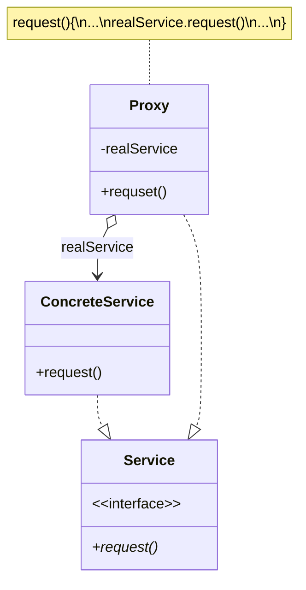

## 定义
**代理模式**是一种结构型设计模式， 让你能够提供对象的替代品或其占位符。 代理控制着对于原对象的访问， 并允许在将请求提交给对象前后进行一些处理。

## 类图


**服务接口** （Service） 声明了服务接口。 代理必须遵循该接口才能伪装成服务对象。

**服务** （ConcreteService） 类提供了一些实用的业务逻辑。

**代理** （Proxy） 类包含一个指向服务对象的引用成员变量。 代理完成其任务 （例如延迟初始化、 记录日志、 访问控制和缓存等） 后会将请求传递给服务对象。通常情况下， 代理会对其服务对象的整个生命周期进行管理。

## c++实现
```cpp
#include <iostream>
using namespace std;

class Subject {
public:
  virtual void request() = 0;
  virtual ~Subject() {}
};

class RealSubject : public Subject {
public:
  void request() { cout << "RealSubject::request()" << endl; }
  ~RealSubject() { cout << "~RealSubject()" << endl; }
};

class Proxy : public Subject {
private:
  Subject *realSubject;
  bool checkAccess() {
    cout << "Proxy::checkAccess()" << endl;
    return true;
  }

  void logAccess() { cout << "Proxy::logAccess()" << endl; }

public:
  Proxy(Subject *realSubject) : realSubject(realSubject) {}
  ~Proxy() { delete realSubject; }

  void request() {
    if (checkAccess()) {
      realSubject->request();
      logAccess();
    }
  }
};

int main(int argc, char *argv[]) {
  Subject *subject = new Proxy(new RealSubject());
  subject->request();
  delete subject;
  return 0;
}
```

## 应用场景
- 远程代理 代理磁盘或者远程主机上的对象
- 虚代理 在初始化时不必要创建对应的被代理的对象，可以根据需要创建，这在创建被代理的对象开销大时用处很大
- 保护代理 如果你只希望特定客户端使用服务对象， 这里的对象可以是操作系统中非常重要的部分， 而客户端则是各种已启动的程序 （包括恶意程序）， 此时可使用代理模式
- 智能指针`unique_ptr`, `shared_ptr`... 托管被代理对象，管理它的生命周期

## 效果
**优点**
-   你可以在客户端毫无察觉的情况下控制服务对象。
-   如果客户端对服务对象的生命周期没有特殊要求， 你可以对生命周期进行管理。
-   即使服务对象还未准备好或不存在， 代理也可以正常工作。
-   _开闭原则_。 你可以在不对服务或客户端做出修改的情况下创建新代理。

**缺点**
-   代码可能会变得复杂， 因为需要新建许多类。
-   服务响应可能会延迟。

## 与其他模式的关系
- 适配器模式能为被封装对象提供不同的接口， 代理模式能为对象提供相同的接口， 装饰模式则能为对象提供加强的接口。

-   外观模式与代理的相似之处在于它们都缓存了一个复杂实体并自行对其进行初始化。 代理与其服务对象遵循同一接口， 使得自己和服务对象可以互换， 在这一点上它与外观不同。

- 装饰和代理有着相似的结构， 但是其意图却非常不同。 这两个模式的构建都基于组合原则， 也就是说一个对象应该将部分工作委派给另一个对象。 两者之间的不同之处在于代理通常自行管理其服务对象的生命周期， 而装饰的生成则总是由客户端进行控制。