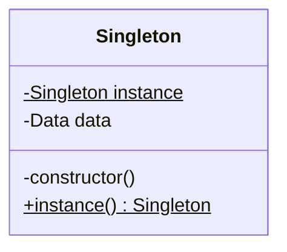

## 定义
单例对象的类必须保证只有一个实例存在。许多时候整个系统只需要拥有一个的全局对象，这样有利于我们协调系统整体的行为

## 类图


## c++(不完善的)实现

### 懒汉
```cpp
#include <iostream>

using namespace std;

class LazyloadSingleton {
private:
  static LazyloadSingleton *instance;
  LazyloadSingleton() { value = 0; }

public:
  int value;

  static const LazyloadSingleton &getInstance() {
    if (instance == NULL) {
      instance = new LazyloadSingleton();
    }
    return *instance;
  }
};

LazyloadSingleton *LazyloadSingleton::instance = NULL;

int main() {
  std::cout << LazyloadSingleton::getInstance().value << std::endl;
  std::cout << LazyloadS`ingleton::getInstance().value << std::endl;
  return 0;
}
```
单线程实现，多线程不安全


### 饿汉
```cpp
#include <iostream>

using namespace std;

class LazyloadSingleton {
private:
  static LazyloadSingleton *instance;
  LazyloadSingleton() { value = 0; }

public:
  int value;

  static const LazyloadSingleton &getInstance() { return *instance; }
};

LazyloadSingleton *LazyloadSingleton::instance = new LazyloadSingleton();

int main() {
  std::cout << LazyloadSingleton::getInstance().value << std::endl;
  return 0;
}
```
no-local static对象在不同编译单元中的初始化顺序是未定义的。也即，`static Singleton& getInstance()`调用时还未初始化`instance`此时会返回一个未定义的实例。