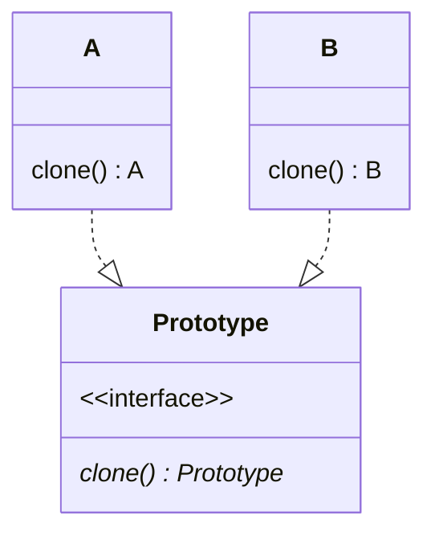

## 定义
原型模式是创建型模式的一种，其特点在于通过“复制”一个已经存在的实例来返回新的实例,而不是新建实例。被复制的实例就是我们所称的“原型”，这个原型是可定制的。 

原型模式多用于创建复杂的或者耗时的实例，因为这种情况下，复制一个已经存在的实例使程序运行更高效；或者创建值相等，只是命名不一样的同类数据。 

## 类图

```mermaid
classDiagram

class Prototype{
&lt;&lt;interface&gt;&gt;
clone()*Prototype
}

class A{
clone() A
}

class B{
clone() B
}

A ..|> Prototype
B ..|> Prototype
```
## c++实现
即拷贝构造函数注意深拷贝和浅拷贝
