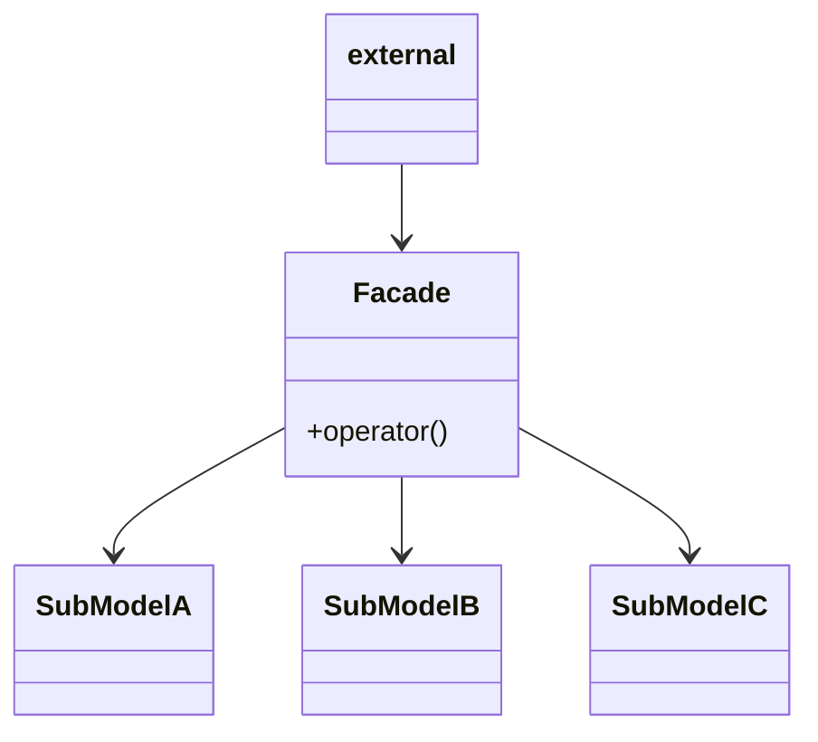

## 定义
**门面模式：**（Facade Design Pattern）门面模式也叫外观模式，门面模式为子系统提供一组统一的接口，定义一组高层接口让子系统更易用。

门面模式原理和实现也比较简单，应用场景也比较明确，主要在接口设计方面使用。
## 类图

-   **门面角色**：客户端调用这个角色的方法。此角色知晓相关的子系统的功能和责任。正常情况下，本角色会将所有从客户端发来的请求委派到相应的子系统中去。
-   **子系统角色**：可以同时有一个或者多个子系统。每个子系统都不是一个单独的类，而是一个类的集合。每一个子系统都可以被客户端直接调用，或者被门面角色直接调用。子系统并不知道门面的存在，罪域子系统而言，门面仅仅是另一个客户端而已。

## 效果

**1. 解决易用性问题**

这个很容易理解，门面模式可以用来封装系统的底层实现，隐藏系统的复杂性，提供一组更加简单易用、更高层的接口。比如，Linux 系统调用函数就可以看作一种“门面”。它是 Linux 操作系统暴露给开发者的一组“特殊”的编程接口，它封装了底层更基础的 Linux 内核调用。

**2. 解决性能问题**

我们知道，App 和服务器之间是通过移动网络通信的，网络通信耗时比较多，为了提高 App 的响应速度，我们要尽量减少 App 与服务器之间的网络通信次数。

假设，完成某个业务功能（比如显示某个页面信息）需要“依次”调用 a、b、d 三个接口。如果我们发现过多的网络通信次数造成客户端响应速度慢，此时就可以利用门面模式，让后端服务器提供一个包裹 a、b、d 三个接口调用的接口 x。App 客户端调用一次接口 x 就可以了，减少了网络通信次数。

**3. 解决分布式事务问题**
假设在一个金融系统中，用户注册需要创建用户和创建用户钱包。用户注册需要支持事务，也就是创建用户和钱包两个操作，要么都成功，要么都失败，不能一个成功，一个失败。 要想两个接口调用在一个事务中执行，是比较难以实现的。此时，我们就可以使用门面模式，将两个接口操作实现放在一个接口中，并使用 Spring 框架提供的事务来控制。