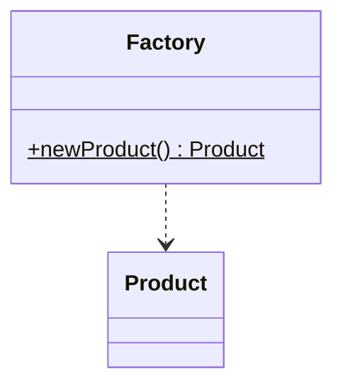
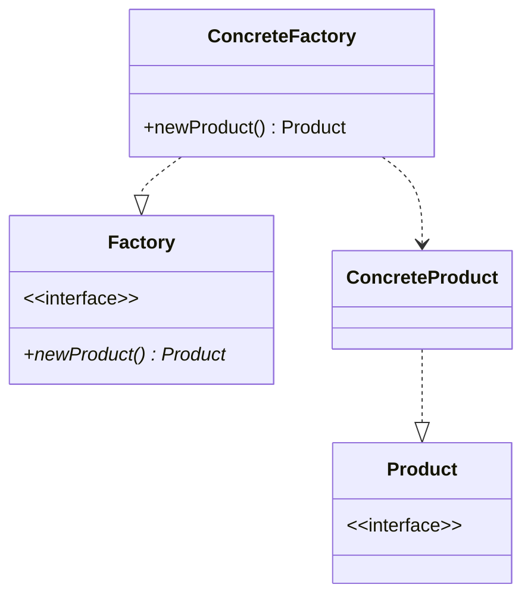
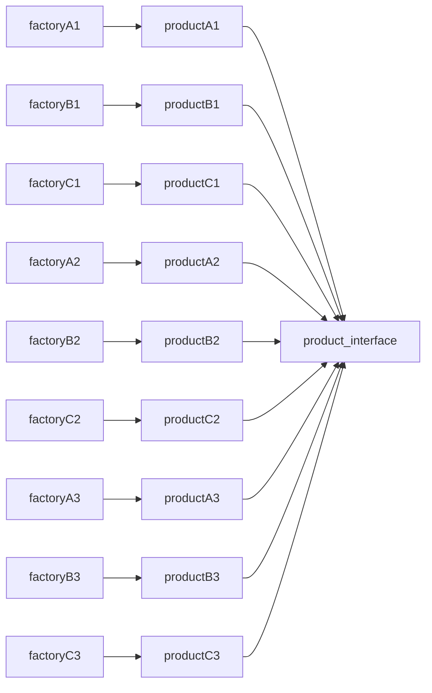
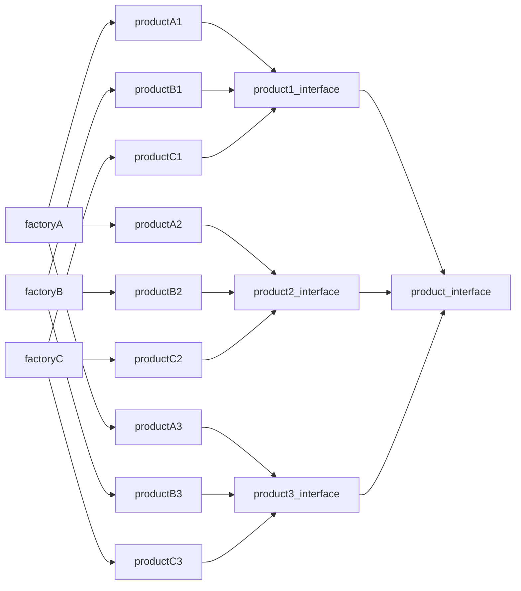
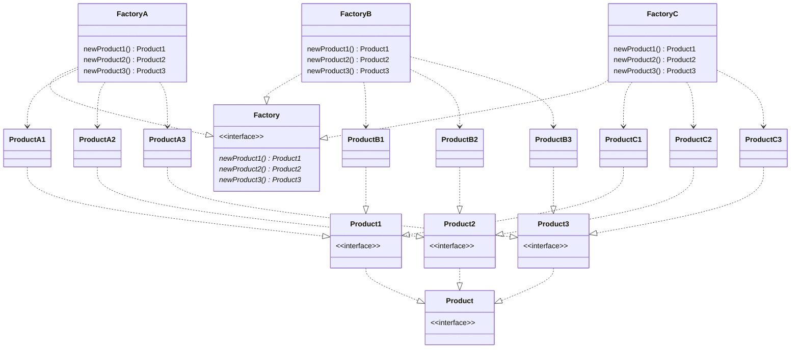

## 原因
要创建的对象需要一系列复杂的初始化操作，比如查配置文件、查数据库表、初始化成员对象等，如果把这些逻辑放在构造函数中，会极大影响代码的可读性。不妨定义一个类来专门负责对象的创建，这样的类就是工厂类，这种做法就是工厂模式，在任何需要生成复杂对象的地方，都可以使用工厂模式。

----
## 简单（静态）工厂

### 类图


### c++实现
```cpp
#include <iostream>

using namespace std;

class Animal {
public:
  virtual void speak() { cout << "Animal speaking" << endl; };
};

class Dog : public Animal {
public:
  void speak() { cout << "汪" << endl; }
  ~Dog() {}
};

class Cat : public Animal {
public:
  void speak() { cout << "喵" << endl; }
  ~Cat() {}
};

class AnimalFactory {
public:
  enum class AnimalType { Dog, Cat, Unknown };
  static Dog *createDog() { return new Dog(); }
  static Cat *createCat() { return new Cat(); }
  static Animal *createAnimal(AnimalType type) {
    switch (type) {
    case AnimalType::Dog:
      return new Dog();
    case AnimalType::Cat:
      return new Cat();
    default:
      return new Animal();
    }
  }
};

int main() {
  Animal *dog = AnimalFactory::createAnimal(AnimalFactory::AnimalType::Dog);
  Animal *cat = AnimalFactory::createAnimal(AnimalFactory::AnimalType::Cat);
  Animal *Unknown =
      AnimalFactory::createAnimal(AnimalFactory::AnimalType::Unknown);
  dog->speak();
  cat->speak();
  Unknown->speak();
  return 0;
}
```

### 优缺点
- 简单代码量小
- 当需求改变时, 需要创建其他类的对象时要修改原有代码，不符合开闭原则
----
## 工厂方法

### 类图



### 与简单工厂方法比较
相较于简单工厂方法，本模式提供了一个接口，当我们需要新的类型的对象时，我们只要提供一个具体的类和工厂类即可，不会影响原有代码，符合开闭原则

### c++实现
```cpp
#include <iostream>

using namespace std;

class Animal {
public:
  virtual void speak() { cout << "Animal speaking" << endl; };
};

class AnimalFactory {
public:
  virtual Animal *createAnimal() = 0;
};
class Dog : public Animal {
public:
  void speak() { cout << "汪" << endl; }
  ~Dog() {}
};

class Cat : public Animal {
public:
  void speak() { cout << "喵" << endl; }
  ~Cat() {}
};

class DogFactory : public AnimalFactory {
public:
  Animal *createAnimal() { return new Dog(); }
};

class CatFactory : public AnimalFactory {
public:
  Animal *createAnimal() { return new Cat(); }
};

int main() {
  AnimalFactory *dogFactory = new DogFactory();
  Animal *dog = dogFactory->createAnimal();
  dog->speak();
  AnimalFactory *catFactory = new CatFactory();
  Animal *cat = catFactory->createAnimal();
  cat->speak();
  return 0;
}
```

----
## 抽象工厂

### 工厂模式的问题
工厂模式对于每一个具体产品，都要编写一个工厂类。如电脑配件产品，有华硕牌主板、华硕牌显卡、华硕牌电源、联想主板、联想显卡、联想电源......如果每一种工厂都要生产一种产品的话需要设计6个具体工厂类。容易造成子类数量爆炸的问题，如下图所示

但是我们注意到有一个特征可以被抽取出来，比如产品的牌子、这里要生产两组产品产品: 华硕牌电子配件和联想电子配件。因此我们采用抽象工厂模式，每一个具体工厂生产不同牌子的产品。简单来说：工厂方法模式的工厂是创建出一种产品，而抽象工厂是创建出一类产品。对于抽象工厂来说。生产的产品有多级抽象属性。如这里的产品种类（显卡电源主板.....）和产品品牌，且有一类抽象的实现比较稳定。如这里的产品种类。如果需要新生产显示器产品的话又要大改。那么我们可以把另一类抽象作为被抽取的特征


### 类图


### c++实现
```cpp
#include <iostream>

using namespace std;

class ElecComponent {
public:
  virtual void show() = 0;
};

class Matherboard : public ElecComponent {};

class AsusMatherboard : public Matherboard {
public:
  void show() { cout << "Asus Matherboard" << endl; }
};

class LenovoMatherboard : public Matherboard {
public:
  void show() { cout << "Lenovo Matherboard" << endl; }
};

class GraphicsCard : public ElecComponent {};

class AsusGraphicsCard : public GraphicsCard {
public:
  void show() { cout << "Asus GraphicsCard" << endl; }
};

class LenovoGraphicsCard : public GraphicsCard {
public:
  void show() { cout << "Lenovo GraphicsCard" << endl; }
};

class PowerSupply : public ElecComponent {};

class AsusPowerSupply : public PowerSupply {
public:
  void show() { cout << "Asus PowerSupply" << endl; }
};

class LenovoPowerSupply : public PowerSupply {
public:
  void show() { cout << "Lenovo PowerSupply" << endl; }
};

class Factory {
public:
  virtual Matherboard *newMatherboard() = 0;
  virtual GraphicsCard *newGraphicsCard() = 0;
  virtual PowerSupply *newPowerSupply() = 0;
};

class AsusFactory : public Factory {
public:
  Matherboard *newMatherboard() { return new AsusMatherboard(); }
  GraphicsCard *newGraphicsCard() { return new AsusGraphicsCard(); }
  PowerSupply *newPowerSupply() { return new AsusPowerSupply(); }
};

class LenovoFactory : public Factory {
public:
  Matherboard *newMatherboard() { return new LenovoMatherboard(); }
  GraphicsCard *newGraphicsCard() { return new LenovoGraphicsCard(); }
  PowerSupply *newPowerSupply() { return new LenovoPowerSupply(); }
};

int main() {
  Factory *asus = new AsusFactory();
  Factory *lenovo = new LenovoFactory();

  Matherboard *asusMatherboard = asus->newMatherboard();
  GraphicsCard *asusGraphicsCard = asus->newGraphicsCard();
  PowerSupply *asusPowerSupply = asus->newPowerSupply();

  Matherboard *lenovoMatherboard = lenovo->newMatherboard();
  GraphicsCard *lenovoGraphicsCard = lenovo->newGraphicsCard();
  PowerSupply *lenovoPowerSupply = lenovo->newPowerSupply();

  asusMatherboard->show();
  asusGraphicsCard->show();
  asusPowerSupply->show();

  lenovoMatherboard->show();
  lenovoGraphicsCard->show();
  lenovoPowerSupply->show();

  return 0;
}
```

### 优缺点

- 多了一层抽象，减少了工厂的数量
- 难以扩展产品族，如这里要增加显示器产品的话那么我们要修改`Factory`、`AsusFactory`和`lenovo`这三个类的代码了