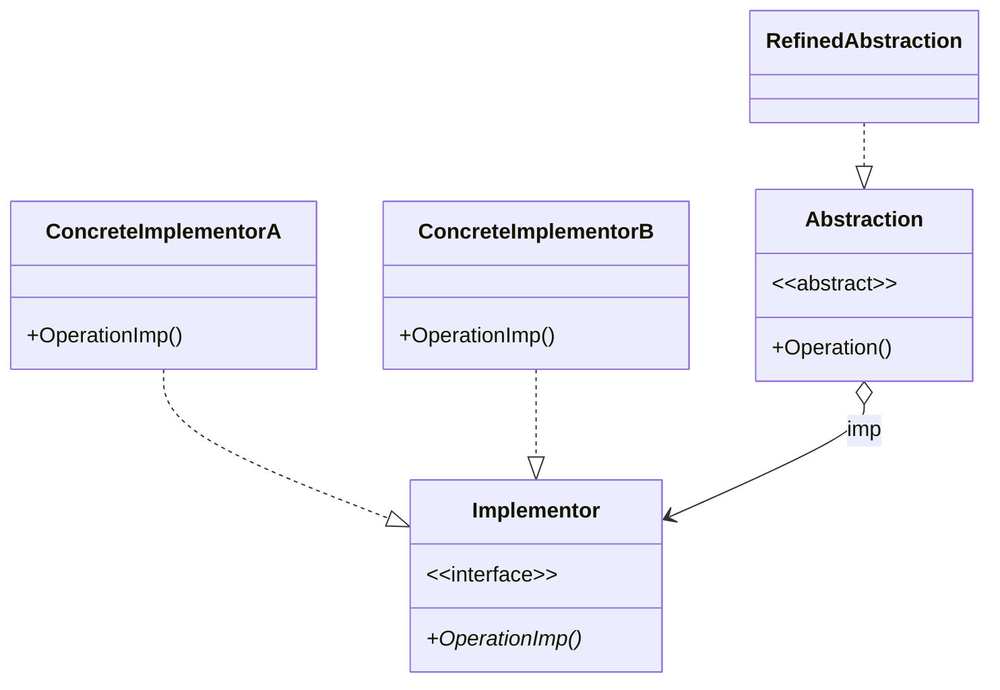

## 定义
把抽象化与实现化解耦，使得二者可以独立变化。这种类型的设计模式属于结构型模式，它通过提供抽象化和实现化之间的桥接结构，来实现二者的解耦。

人话: 某一接口可视为两个独立变化维度，假定这两个维度的实现各有$M$和$N$种，假定采用传统设计模式那么要设计$M\times N$个实现类，很容易出现实现类数量爆炸的问题，为了解决该问题，对于这两个变化维度我们可以设计两个接口，那么各有$M$和$N$个实现类，再把这个两个接口组装起来比如让某个接口去使用某些接口。那么我们通过实现了$M+N$个类就解决了上面的问题
## 类图

：

-   **抽象化(Abstraction)角色**：抽象化给出的定义，并保存一个对实现化对象的引用。
-   **修正抽象化(RefinedAbstraction)角色**：扩展抽象化角色，改变和修正父类对抽象化的定义。
-   **实现化(Implementor)角色**：这个角色给出实现化角色的接口，但不给出具体的实现。必须指出的是，这个接口不一定和抽象化角色的接口定义相同，实际上，这两个接口可以非常不一样。实现化角色应当只给出底层操作，而抽象化角色应当只给出基于底层操作的更高一层的操作。
-   **具体实现化(ConcreteImplementor)角色**：这个角色给出实现化角色接口的具体实现。
## c++实现
```cpp
#include <iostream>
#include <string>

using namespace std;

class Drink {
public:
  virtual string name() = 0;
};

class Coffee : public Drink {
public:
  string name() { return "Coffee"; }
};

class Tea : public Drink {
public:
  string name() { return "Tea"; }
};

class Milk : public Drink {
public:
  string name() { return "Milk"; }
};

class DrinkWithFlavor {
private:
  Drink *drink;

public:
  virtual string flavor() = 0;
  DrinkWithFlavor(Drink *drink) : drink(drink) {}
  void show() {
    cout << "Drink " + drink->name() << " with " << flavor() << endl;
  }
};

class DrinkWithSugar : public DrinkWithFlavor {
public:
  DrinkWithSugar(Drink *drink) : DrinkWithFlavor(drink) {}
  string flavor() { return "Sugar"; }
};

class DrinkWithHoney : public DrinkWithFlavor {
public:
  DrinkWithHoney(Drink *drink) : DrinkWithFlavor(drink) {}
  string flavor() { return "Honey"; }
};

int main() {
  Drink *coffee = new Coffee();
  Drink *tea = new Tea();
  Drink *milk = new Milk();

  DrinkWithFlavor *coffeeWithSugar = new DrinkWithSugar(coffee);
  DrinkWithFlavor *teaWithHoney = new DrinkWithHoney(tea);
  DrinkWithFlavor *milkWithSugar = new DrinkWithSugar(milk);

  coffeeWithSugar->show();
  teaWithHoney->show();
  milkWithSugar->show();

  return 0;
}
```
## 效果

**优点：**
-   分离抽象接口及其实现部分。桥接模式使用“对象间的关联关系”解耦了抽象和实现之间固有的绑定关系，使得抽象和实现可以沿着各自的维度来变化。所谓抽象和实现沿着各自维度的变化，也就是说抽象和实现不再在同一个继承层次结构中，而是“子类化”它们，使它们各自都具有自己的子类，以便任何组合子类，从而获得多维度组合对象。
-   在很多情况下，桥接模式可以取代多层继承方案，多层继承方案违背了“单一职责原则”，复用性较差，且类的个数非常多，桥接模式是比多层继承方案更好的解决方法，它极大减少了子类的个数。
-   桥接模式提高了系统的可扩展性，在两个变化维度中任意扩展一个维度，都不需要修改原有系统，符合“开闭原则”。

**缺点：**
-   桥接模式的使用会增加系统的理解与设计难度，由于关联关系建立在抽象层，要求开发者一开始就针对抽象层进行设计与编程。
-   桥接模式要求正确识别出系统中两个独立变化的维度，因此其使用范围具有一定的局限性，如何正确识别两个独立维度也需要一定的经验积累。
