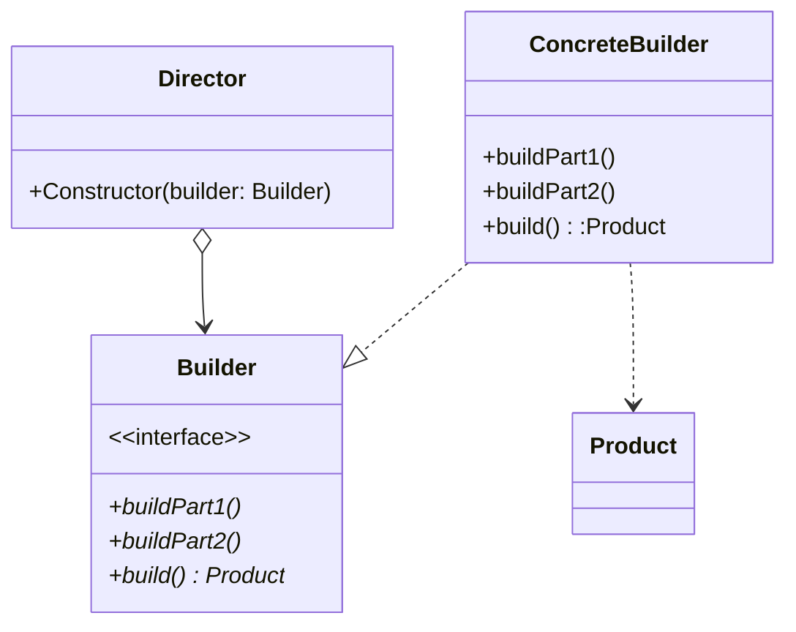

## 定义
> *将一个复杂对象的构建与它的表示分离，使得同样的构建过程可以创建不同的表示。*

使用多个小型工厂一步步构建出一个复杂对象


## 类图

- Director 提供构建算法
## c++实现
### 一个简单实现
使用链式调用非传统实现
```cpp
#include <iostream>
#include <string>

using namespace std;

class Computer {
private:
  string _cpu;
  string _ram;
  string _hdd;
  string _gpu;
  string _ssd;

public:
  class ComputerBuilder {
  private:
    Computer *_computer;

  public:
    ComputerBuilder(string cpu, string ram) {
      _computer = new Computer(cpu, ram);
    }
    ComputerBuilder &set_hdd(string hdd) {
      _computer->set_hdd(hdd);
      return *this;
    }
    ComputerBuilder &set_gpu(string gpu) {
      _computer->set_gpu(gpu);
      return *this;
    }
    ComputerBuilder &set_ssd(string ssd) {
      _computer->set_ssd(ssd);
      return *this;
    }
    Computer *build() { return _computer; }
  };
  Computer(string cpu, string ram) : _hdd(""), _gpu(""), _ssd("") {
    _cpu = cpu;
    _ram = ram;
  }
  string cpu() { return _cpu; }
  string ram() { return _ram; }
  string hdd() { return _hdd; }
  string gpu() { return _gpu; }
  string ssd() { return _ssd; }

  void set_cpu(string cpu) { _cpu = cpu; }
  void set_ram(string ram) { _ram = ram; }
  void set_hdd(string hdd) { _hdd = hdd; }
  void set_gpu(string gpu) { _gpu = gpu; }
  void set_ssd(string ssd) { _ssd = ssd; }

  void show() {
    cout << "CPU: " << _cpu << endl;
    cout << "RAM: " << _ram << endl;
    cout << "HDD: " << _hdd << endl;
    cout << "GPU: " << _gpu << endl;
    cout << "SSD: " << _ssd << endl;
  }
};

int main() {
  Computer *pc = Computer::ComputerBuilder("i7", "16GB")
                     .set_gpu("GTX 1080")
                     .set_ssd("512GB")
                     .build();
  pc->show();
  return 0;
}
```
### 使用Director的传统实现
```cpp
#include <iostream>
#include <string>

using namespace std;

class Computer {
private:
  string _cpu;
  string _ram;
  string _hdd;
  string _gpu;
  string _ssd;

public:
  Computer(string cpu, string ram) : _hdd(""), _gpu(""), _ssd("") {
    _cpu = cpu;
    _ram = ram;
  }
  string cpu() { return _cpu; }
  string ram() { return _ram; }
  string hdd() { return _hdd; }
  string gpu() { return _gpu; }
  string ssd() { return _ssd; }

  void set_cpu(string cpu) { _cpu = cpu; }
  void set_ram(string ram) { _ram = ram; }
  void set_hdd(string hdd) { _hdd = hdd; }
  void set_gpu(string gpu) { _gpu = gpu; }
  void set_ssd(string ssd) { _ssd = ssd; }

  void show() {
    cout << "CPU: " << _cpu << endl;
    cout << "RAM: " << _ram << endl;
    cout << "HDD: " << _hdd << endl;
    cout << "GPU: " << _gpu << endl;
    cout << "SSD: " << _ssd << endl;
  }
};

class Builder {
public:
  virtual void build_cpu(){};
  virtual void build_ram(){};
  virtual void build_hdd(){};
  virtual void build_gpu(){};
  virtual void build_ssd(){};
  virtual Computer *build() { return nullptr; };
};

class MacbookBuilder : public Builder {
private:
  Computer *_computer;

public:
  MacbookBuilder(string cpu, string ram) { _computer = new Computer(cpu, ram); }
  void build_cpu() override { _computer->set_cpu("m1"); }
  void build_ram() override { _computer->set_ram("16GB"); }
  void build_hdd() override { _computer->set_hdd("1TB"); }
  void build_gpu() override { _computer->set_gpu("m1"); }
  void build_ssd() override { _computer->set_ssd("512GB"); }
  Computer *build() override { return _computer; }
};

class LenovoBuilder : public Builder {
private:
  Computer *_computer;

public:
  LenovoBuilder(string cpu, string ram) { _computer = new Computer(cpu, ram); }
  void build_cpu() override { _computer->set_cpu("i7"); }
  void build_ram() override { _computer->set_ram("8GB"); }
  void build_hdd() override { _computer->set_hdd("1TB"); }
  void build_gpu() override { _computer->set_gpu("Nvidia"); }
  void build_ssd() override { _computer->set_ssd("256GB"); }
  Computer *build() override { return _computer; }
};

class Director {
public:
  Computer *make(Builder *builder) {
    builder->build_cpu();
    builder->build_ram();
    builder->build_hdd();
    builder->build_gpu();
    builder->build_ssd();
    return builder->build();
  }
};

int main() {
  Director director;
  MacbookBuilder macbook_builder("i5", "8GB");
  LenovoBuilder lenovo_builder("i7", "16GB");
  Computer *macbook = director.make(&macbook_builder);
  Computer *lenovo = director.make(&lenovo_builder);
  macbook->show();
  cout << endl;
  lenovo->show();
  return 0;
}
```
## 效果
-   它使你可以改变一个产品的内部表示
-   它将构造代码和表示代码分开
-   它使你可对构造过程进行更精细的控制
## 例子
StringBuilder类