## 类的关系

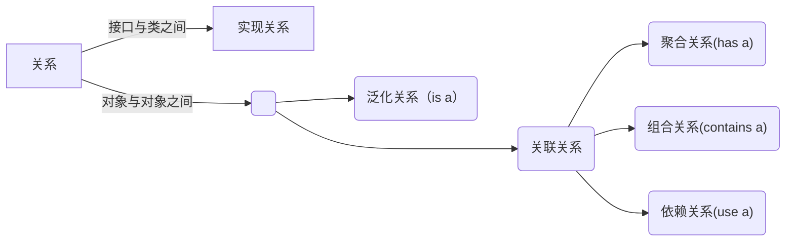

### 实现关系 Implementation

例 A类实现了XXX接口

### 继承关系 Inheritance

例 班长类是学生类的派生子类。

则班长类的一个实例对象 is a 学生类的实例对象

### 关联关系 Association

简单的来说即一个对象或者类方法中持有另一个对象的引用、指针或对象本身

关联关系有单向关联和双向关联。如果两个对象都知道（即可以调用）对方的公共属性和操作，那么二者就是双向关联。如果只有一个对象知道（即可以调用）另一个对象的公共属性和操作，那么就是单向关联。
多重关联一个对象可以持有其它对象的数组或者集合。

### 依赖关系 Dependency
如一个司机类的对象A调用开车方法需要一个汽车的引用B作为参数。那么说司机对象use a汽车对象。 

弱关联关系。如果对象A用到对象B，但是和B的关系不是太明显的时候，就可以把这种关系看作是依赖关系。

依赖关系在Java中的具体代码表现形式为B为A的构造器或方法中的局部变量、方法或构造器的参数、方法的返回值，或者A调用B的静态方法。

### 聚合关系 Aggregation

A对象持有B对象的所有权，但不一定是单一所有权。

例如，公司部门与员工的关系，一个员工可以属于多个部门，一个部门撤消了，员工可以转到其它部门。即部门对象 has 员工对象

### 组合关系 Composition

A对象持有B对象的单一所有权。A的生命周期覆盖B的生命周期。那么A contains B

## UML类图表示法

### 具体类

#### 访问权限修饰符

- `+` public
- `-` private
- `#` protected
- 不加修饰符默认为default

#### 静态成员表示
静态成员用下划线表示

#### java
```java
public class Dog {
	private final String name;
	protect final int weight;
	public static final int static_member = 1;
	int age;

	public void speak(){
		/*
		*code snippets
		*/
	}

	public String getName(){ return this.name; }
	public void setName(String name) { this.name = name; }
	public static void foo(){}
}
```

#### uml
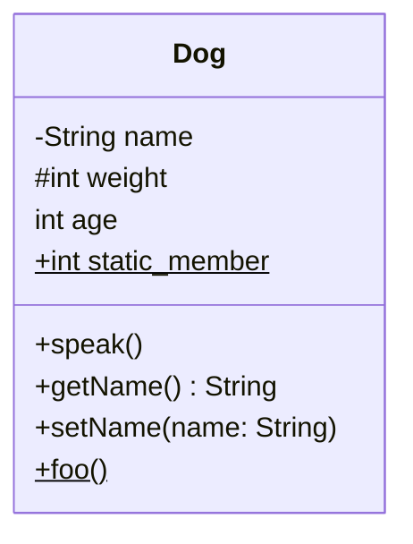

### 抽象修饰符
抽象方法和抽象类用斜体表示

#### java
```java
public abstract class Base {
	int member;
	public abstract void foo();
}
```

#### uml
注: mermaid里的抽象类用 `<<abstract>>`表示
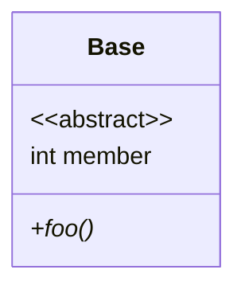

### 接口、枚举

接口用`<<interface>>`表示，枚举用`<<enumeration>>`表示
#### uml
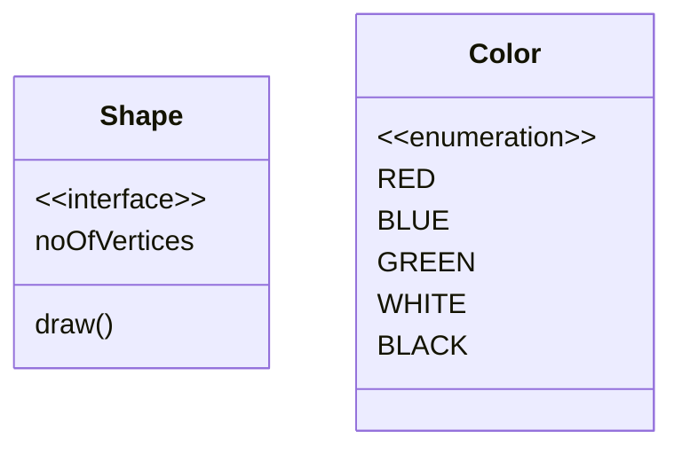

### 泛型
#### uml
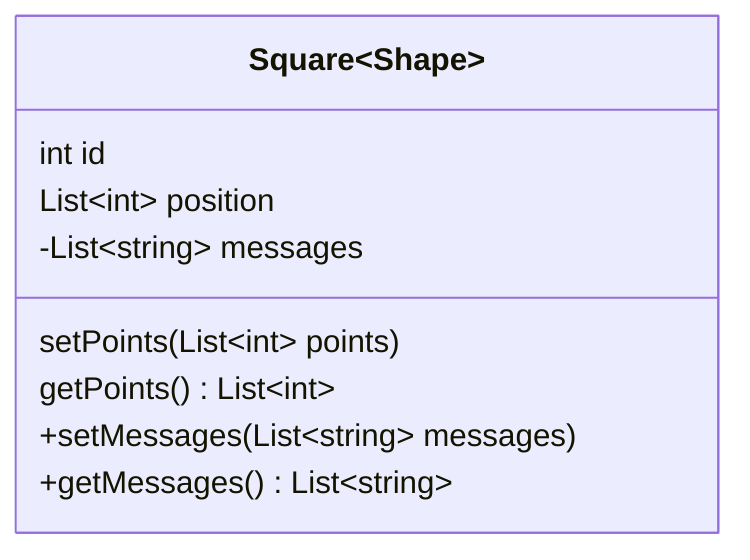


### 类的关系表示法

#### 继承
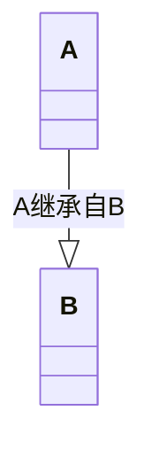

#### 实现
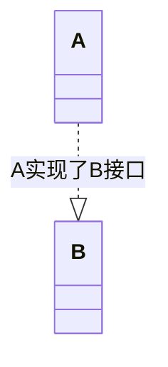

#### 关联
- 单向关联

- 双向关联
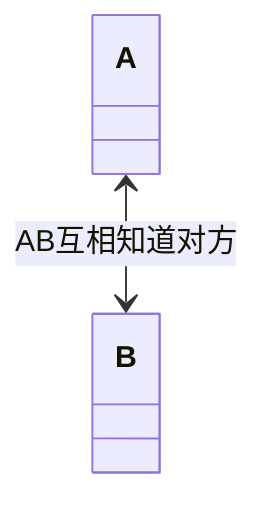
- 多重关联

在UML中，通过放置多重性（multipicity）表达式在关联线的末端来表示。多重性表达式可以是一个数字、一段范围或者是它们的组合。
1.  数字：精确的数量
2.  `*`或者`0..*`：表示0到多个
3.   `0..1`：表示0或者1个，在Java中经常用一个空引用来实现
4.   `1..*`：表示1到多个
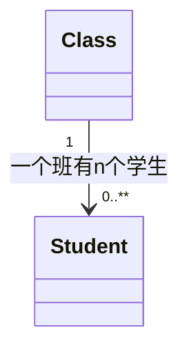
#### 依赖
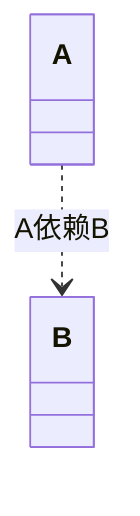

#### 聚合

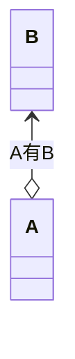

#### 组合

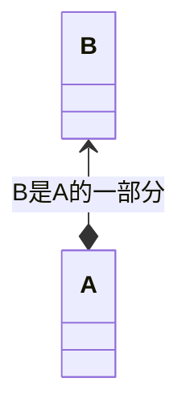
