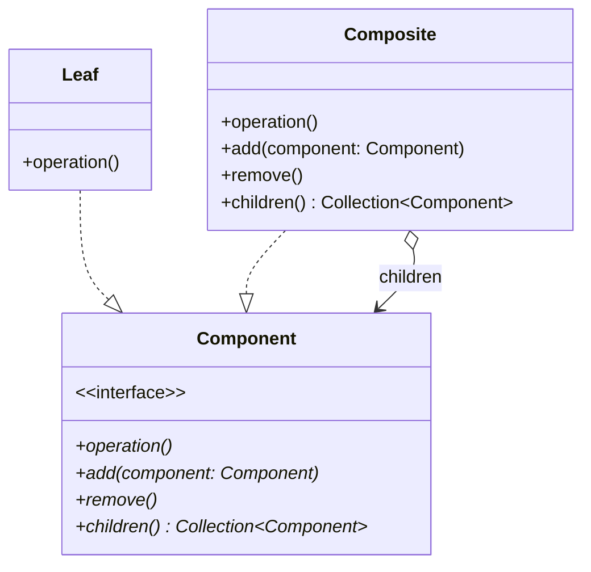

## 定义
组合模式（Composite Pattern），又叫部分整体模式，是用于把一组相似的对象当作一个单一的对象。组合模式依据树形结构来组合对象，用来表示部分以及整体层次。这种类型的设计模式属于结构型模式，它创建了对象组的树形结构。

## 类图

## c++实现
```cpp
#include <iostream>
#include <string>
#include <vector>

using namespace std;

class File {
public:
  typedef vector<File *> &FileList;
  virtual string name() = 0;
  virtual void rename(string name) = 0;
  virtual File *parent() = 0;
  virtual string path() = 0;
  virtual void set_parent(File *parent) = 0;
  virtual FileList children() = 0;
  virtual File *child(int index) = 0;
  virtual void add(File *file) = 0;
  virtual void remove(int index) = 0;
};

class Directory : public File {
private:
  string _name;
  File *_parent;
  vector<File *> _children;

public:
  Directory(string name, File *parent = nullptr)
      : _name(name), _parent(parent) {
    if (_parent != nullptr) {
      _parent->add(this);
    }
  }
  string name() { return _name; }
  void rename(string name) { _name = name; }
  File *parent() { return _parent; }
  void set_parent(File *parent) { _parent = parent; }
  string path() {
    if (_parent == nullptr)
      return _name;
    else
      return _parent->path() + "/" + _name;
  }

  vector<File *> &children() { return _children; }
  File *child(int index) { return _children[index]; }
  void add(File *file) { _children.push_back(file); }
  void remove(int index) { _children.erase(_children.begin() + index); }
};

class TextFile : public File {
private:
  string _name;
  File *_parent;
  vector<File *> _null;

public:
  TextFile(string name, File *parent = nullptr)
      : _name(name), _parent(parent), _null(0) {
    if (_parent != nullptr) {
      _parent->add(this);
    }
  }
  string name() { return _name; }
  void rename(string name) { _name = name; }
  File *parent() { return _parent; }
  void set_parent(File *parent) { _parent = parent; }
  string path() {
    if (_parent == nullptr)
      return _name;
    else
      return _parent->path() + "/" + _name;
  }

  vector<File *> &children() { return _null; }
  File *child(int index) { return nullptr; }
  void add(File *file) {}
  void remove(int index) {}
};

template <typename func> void file_iterator(File *file, func f) {
  f(file);
  for (File *child : file->children()) {
    file_iterator(child, f);
  }
}

int main() {
  Directory *root = new Directory("root");
  Directory *home = new Directory("home", root);
  Directory *user = new Directory("user", home);
  TextFile *a = new TextFile("a.txt", user);
  TextFile *b = new TextFile("b.txt", user);
  TextFile *c = new TextFile("c.txt", home);
  TextFile *d = new TextFile("d.txt", root);
  file_iterator(root, [](File *file) { cout << file->path() << endl; });
  return 0;
}
```

## 效果
- 高层模块调用简单。 
- 节点自由增加。

## 例子
- 算术表达式包括操作数、操作符和另一个操作数，其中，另一个操作数也可以是操作数、操作符和另一个操作数。 
- 在 JAVA AWT 和 SWING 中，对于 Button 和 Checkbox 是树叶，Container 是树枝。