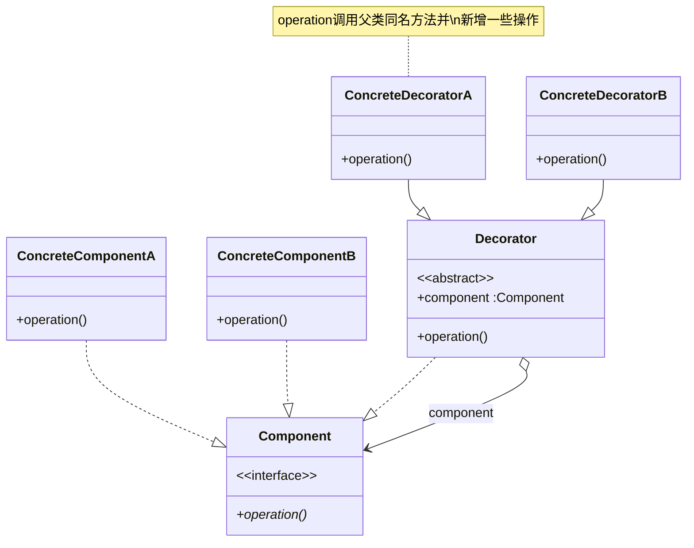

## 定义
**装饰器模式**（Decorator Pattern）允许向一个现有的对象添加新的功能，同时又不改变其结构。它是作为现有的类的一个包装。

若要扩展一个对象的功能，**装饰器模式**提供了比**继承**更有弹性的替代方案。**组合优于继承**。

## 类图

**角色组成：**

1.  **抽象构件角色(Component)**: 定义可以动态添加任务的对象的接口
2.  **具体构件角色(ConcreteComponent)**：定义一个要被装饰器装饰的对象，即 Component 的具体实现
3.  **抽象装饰器(Decorator)**: 持有一个构件（Conponent）对象的实例，并定义一个和抽象构件一致的接口。维护对组件对象和其子类组件的引用
4.  **具体装饰器角色(ConcreteDecorator)**：向组件添加新的职责

## 适用性
-   需要扩展一个类的功能，或给一个类增加附加责任。
-   需要动态的给一个对象增加功能，这些功能可以再动态地撤销。
-   需要增加一些基本功能的排列组合而产生的非常大量的功能，从而使继承变得不现实。

## 例子
- java `InputStream`
```java
InputStream in = new FileImputStream("/user/test.txt"); 
InputStream bin = new BufferedInputStream(in);
DataInputStream din = new DataInputStream(bin);
int data = din.readInt();
```