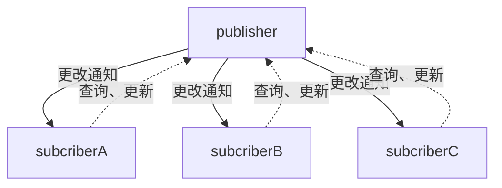
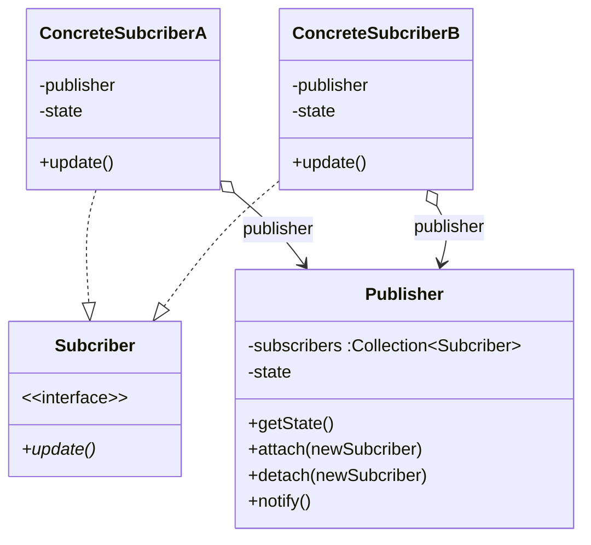

## 定义
**观察者模式**是一种行为设计模式， 允许你定义一种订阅机制， 可在对象事件发生时通知多个 “观察” 该对象的其他对象。

```mermaid
flowchart TD;

publisher --"更改通知"--> subcriberA
publisher --"更改通知"--> subcriberB
publisher --"更改通知"--> subcriberC
subcriberA -."查询、更新".-> publisher
subcriberB -."查询、更新".-> publisher
subcriberC -."查询、更新".-> publisher
```

## 类图

```mermaid
classDiagram

class Publisher{
-subscribers :Collection~Subcriber~
-state
+getState()
+attach(newSubcriber)
+detach(newSubcriber)
+notify()
}

class Subcriber{
&lt;&lt;interface&gt;&gt;
+update()*
}

class ConcreteSubcriberA{
-publisher
-state
+update()
}
class ConcreteSubcriberB{
-publisher
-state
+update()
}

ConcreteSubcriberA ..|> Subcriber
ConcreteSubcriberB ..|> Subcriber
ConcreteSubcriberA o--> Publisher :publisher
ConcreteSubcriberB o--> Publisher :publisher


```

## c++实现
## 适用性
## 效果
## 例子
