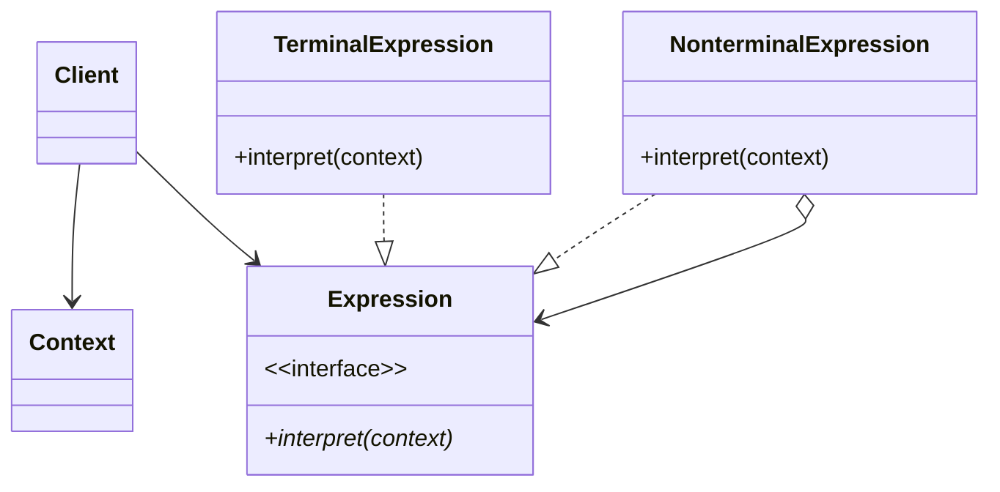

## 定义
解释器模式为某个语言定义它的语法（或者叫文法）表示，并定义一个解释器用来处理这个语法。

## 类图

```mermaid
classDiagram

Client --> Context
Client --> Expression
class Expression{
&lt;&lt;interface&gt;&gt;
+interpret(context)*
}


class TerminalExpression{
+interpret(context)
}

class NonterminalExpression{
+interpret(context)
}

TerminalExpression ..|> Expression
NonterminalExpression ..|> Expression
NonterminalExpression o--> Expression
```
## 例子
编译器、规则引擎、正则表达式
