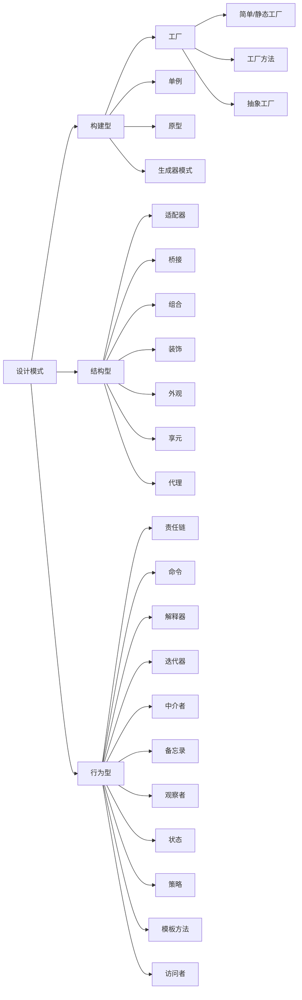

## 六大设计准则
- 单一职责原则
- 开闭原则
- 依赖倒置原则
- 接口隔离原则
- 最少知识原则
## 二十三设计模式

### 构建型
- [[生成器模式]]
- [[工厂模式]]
- [[单例模式]]
- [[原型模式]]

### 结构型模式
- [[适配器模式]]
- [[桥接模式]]
- [[组合模式]]
- [[装饰器模式]]
- [[外观模式]]
- [[享元模式]]
- [[代理模式]]

### 行为型
- [[责任链模式]]
- [[命令模式]]
- [[迭代器模式]]
- [[解释器模式]]
- [[中介者模式]]
- [[备忘录模式]]
- [[观察者模式]]
- [[状态模式]]
- [[策略模式]]
- [[模板方法]]
- [[访问者模式]]

## 参考资料
- **设计模式可复用面对对象软件的基础**
- [refactoringguru](https://refactoringguru.cn/)
- [廖雪峰java程序设计设计模式](https://www.liaoxuefeng.com/wiki/1252599548343744/1264742167474528)