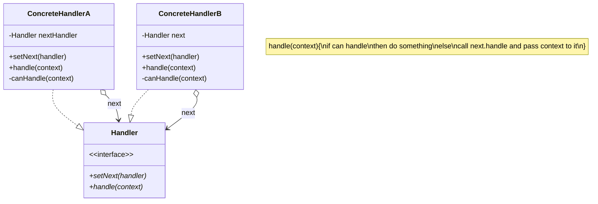

## 定义
**责任链模式**是一种行为设计模式， 允许你将请求沿着处理者链进行发送。 收到请求后， 每个处理者均可对请求进行处理， 或将其传递给链上的下个处理者。
## 类图

## rust实现
```rust
//main.rs
mod hospital;

use hospital::*;

fn main() {
    let mut xiaowang = Patient::new("小王");
    let hospital = Hospital::correct_flow();
    hospital.handle(&mut xiaowang);
    let mut xiaoli = Patient::new("小李");
    let hospital = Hospital::error_flow();
    hospital.handle(&mut xiaoli);
}
//hospital.rs
//流程: 挂号 -> 医生 -> 收费 ->药房
pub struct Hospital{
    first_handler :Option<Box<dyn Handler>>,
}

impl Hospital{
    pub fn new() -> Hospital{
        Hospital{
            first_handler: None,
        }
    }

    fn add_handler(&mut self, handler: Box<dyn Handler>){
        if let Some(ref mut first_handler) = self.first_handler{
            first_handler.pass(handler);
        }else{
            self.first_handler = Some(handler);
        }
    }

    pub fn handle(&self, patient:&mut Patient){
        if let Some(ref first_handler) = self.first_handler{
            let res= first_handler.handle(patient);
            match res{
                Ok(_) => println!("看医院成功!"),
                Err(_) => println!("看医院失败!"),
            }
        }else{
            println!("空的医院!");
        }
    }

    //正确流程
    pub fn correct_flow()->Hospital{
        let mut hospital = Hospital::new();
        hospital.add_handler(Box::new(Register::new()));
        hospital.add_handler(Box::new(Doctor::new()));
        hospital.add_handler(Box::new(Payment::new()));
        hospital.add_handler(Box::new(Pharmacy::new()));
        hospital
    }

    //错误流程
    pub fn error_flow()->Hospital{
        let mut hospital = Hospital::new();
        hospital.add_handler(Box::new(Register::new()));
        hospital.add_handler(Box::new(Register::new()));
        hospital.add_handler(Box::new(Payment::new()));
        hospital.add_handler(Box::new(Doctor::new()));
        hospital.add_handler(Box::new(Pharmacy::new()));
        hospital
    }
}

pub struct Patient{
    name: String,
    has_registered: bool,
    doctor_has_seen: bool,
    has_paid: bool,
}

impl Patient{
    pub fn new(name :&str) -> Patient{
        Patient{
            name: name.to_string(),
            has_registered: false,
            doctor_has_seen: false,
            has_paid: false,
        }
    }

    pub fn register(&mut self){
        self.has_registered = true;
    }

    pub fn has_registered(&self) -> bool{
        self.has_registered
    }

    pub fn see_doctor(&mut self){
        self.doctor_has_seen = true;
    }

    pub fn has_seen_doctor(&self) -> bool{
        self.doctor_has_seen
    }

    pub fn pay(&mut self){
        self.has_paid = true;
    }

    pub fn has_paid(&self) -> bool{
        self.has_paid
    }
}

trait Handler {
    fn pass(&mut self, handler: Box<dyn Handler>);
    fn handle(&self, patient: &mut Patient) -> Result<(),()>;
}

struct Register{
    next: Option<Box<dyn Handler>>,
}

impl Register{
    pub fn new() -> Register{
        Register{
            next: None,
        }
    }
}


impl Handler for Register{
    fn pass(&mut self, handler: Box<dyn Handler>){
        match self.next{
            Some(ref mut next) => next.pass(handler),
            None => self.next = Some(handler),
        }
    }

    fn handle(&self, patient: &mut Patient) -> Result<(),()>{
        if !patient.has_registered(){
            println!("{}正在挂号", patient.name);
            patient.register();
            println!("{}挂号成功", patient.name);
        }else{
            println!("{}已经挂号", patient.name);
        }

        if let Some(ref next) = self.next{
            next.handle(patient)
        }else{
            Ok(())
        }
    }
}

struct Doctor{
    next: Option<Box<dyn Handler>>,
}

impl Doctor{
    pub fn new() -> Doctor{
        Doctor{
            next: None,
        }
    }
}

impl Handler for Doctor{
    fn pass(&mut self, handler: Box<dyn Handler>){
        match self.next{
            Some(ref mut next) => next.pass(handler),
            None => self.next = Some(handler),
        }
    }

    fn handle(&self, patient: &mut Patient) -> Result<(),()>{
        if !patient.has_seen_doctor(){
            println!("{}正在看医生", patient.name);
            patient.see_doctor();
            println!("{}看医生成功", patient.name);
        }else{
            println!("{}已经看过医生", patient.name);
        }

        if !patient.has_registered(){
            println!("{}没有挂号", patient.name);
            return Err(());
        }
        if let Some(ref next) = self.next{
            next.handle(patient)
        }else{
            Ok(())
        }
    }
}

struct Payment{
    next: Option<Box<dyn Handler>>,
}

impl Payment{
    pub fn new() -> Payment{
        Payment{
            next: None,
        }
    }
}

impl Handler for Payment{
    fn pass(&mut self, handler: Box<dyn Handler>){
        match self.next{
            Some(ref mut next) => next.pass(handler),
            None => self.next = Some(handler),
        }
    }

    fn handle(&self, patient: &mut Patient) -> Result<(),()>{
        if !patient.has_paid(){
            println!("{}正在付费", patient.name);
            patient.pay();
            println!("{}付费成功", patient.name);
        }else{
            println!("{}已经付过费", patient.name);
        }

        if !patient.has_registered(){
            println!("{}没有挂号", patient.name);
            return Err(());
        }
        if !patient.has_seen_doctor(){
            println!("{}没有看医生", patient.name);
            return Err(());
        }
        if let Some(ref next) = self.next{
            next.handle(patient)
        }else{
            Ok(())
        }
    }
}

struct Pharmacy{
    next: Option<Box<dyn Handler>>,
}

impl Pharmacy{
    pub fn new() -> Pharmacy{
        Pharmacy{
            next: None,
        }
    }
}

impl Handler for Pharmacy{
    fn pass(&mut self, handler: Box<dyn Handler>){
        match self.next{
            Some(ref mut next) => next.pass(handler),
            None => self.next = Some(handler),
        }
    }

    fn handle(&self, patient: &mut Patient) -> Result<(),()>{
        if !patient.has_registered(){
            println!("{}没有挂号", patient.name);
            return Err(());
        }
        if !patient.has_seen_doctor(){
            println!("{}没有看医生", patient.name);
            return Err(());
        }
        if !patient.has_paid(){
            println!("{}没有付费", patient.name);
            return Err(());
        }
        println!("{}正在取药", patient.name);
        println!("{}取药成功", patient.name);
        Ok(())
    }
}
```

```bash
$ cargo run
    Finished dev [unoptimized + debuginfo] target(s) in 0.00s
     Running `target/debug/chain`
小王正在挂号
小王挂号成功
小王正在看医生
小王看医生成功
小王正在付费
小王付费成功
小王正在取药
小王取药成功
看医院成功!
小李正在挂号
小李挂号成功
小李已经挂号
小李正在付费
小李付费成功
小李没有看医生
看医院失败!
```

## 适用性
- 当程序需要使用不同方式处理不同种类请求， 而且请求类型和顺序预先未知时， 可以使用责任链模式。

- 该模式能将多个处理者连接成一条链。 接收到请求后， 它会 “询问” 每个处理者是否能够对其进行处理。 这样所有处理者都有机会来处理请求。

- 当必须按顺序执行多个处理者时， 可以使用该模式。

- 无论你以何种顺序将处理者连接成一条链， 所有请求都会严格按照顺序通过链上的处理者。

- 如果所需处理者及其顺序必须在运行时进行改变， 可以使用责任链模式。

- 如果在处理者类中有对引用成员变量的设定方法， 你将能动态地插入和移除处理者， 或者改变其顺序。

## 效果
-   你可以控制请求处理的顺序。
-   _单一职责原则_。 你可对发起操作和执行操作的类进行解耦。
-   _开闭原则_。 你可以在不更改现有代码的情况下在程序中新增处理者。

-   部分请求可能未被处理。

## 与其他模式的关系

- 责任链模式、 命令模式、 中介者模式和观察者模式用于处理请求发送者和接收者之间的不同连接方式：
        责任链按照顺序将请求动态传递给一系列的潜在接收者， 直至其中一名接收者对请求进行处理。
        命令在发送者和请求者之间建立单向连接。
        中介者清除了发送者和请求者之间的直接连接， 强制它们通过一个中介对象进行间接沟通。
        观察者允许接收者动态地订阅或取消接收请求。

- 责任链通常和组合模式结合使用。 在这种情况下， 叶组件接收到请求后， 可以将请求沿包含全体父组件的链一直传递至对象树的底部。

- 责任链的管理者可使用命令模式实现。 在这种情况下， 你可以对由请求代表的同一个上下文对象执行许多不同的操作。

- 还有另外一种实现方式， 那就是请求自身就是一个命令对象。 在这种情况下， 你可以对由一系列不同上下文连接而成的链执行相同的操作。

- 责任链和装饰模式的类结构非常相似。 两者都依赖递归组合将需要执行的操作传递给一系列对象。 但是， 两者有几点重要的不同之处。

- 责任链的管理者可以相互独立地执行一切操作， 还可以随时停止传递请求。 另一方面， 各种装饰可以在遵循基本接口的情况下扩展对象的行为。 此外， 装饰无法中断请求的传递。

