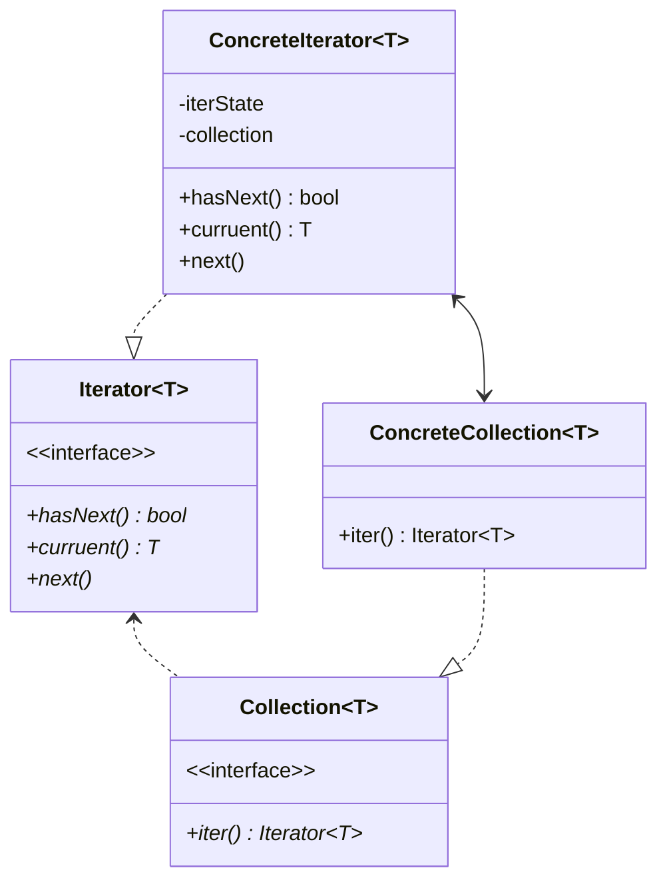

## 定义
**迭代器模式**是一种行为设计模式， 让你能在不暴露集合底层表现形式 （列表、 栈和树等） 的情况下遍历集合中所有的元素。

## 问题
- 只读迭代器
- 支持增删改?在增删改等写操作后迭代器是否会失效？怎么实现一个健壮的迭代器？
- 空迭代器
- 内部迭代器、外部迭代器
- 支持双向移动随机移动？
- 在同一个集合上多个迭代器并行迭代?

## 类图

## 适用性
- 当集合背后为复杂的数据结构， 且你希望对客户端隐藏其复杂性时 （出于使用便利性或安全性的考虑）， 可以使用迭代器模式。

	迭代器封装了与复杂数据结构进行交互的细节， 为客户端提供多个访问集合元素的简单方法。 这种方式不仅对客户端来说非常方便， 而且能避免客户端在直接与集合交互时执行错误或有害的操作， 从而起到保护集合的作用。

- 使用该模式可以减少程序中重复的遍历代码。

	重要迭代算法的代码往往体积非常庞大。 当这些代码被放置在程序业务逻辑中时， 它会让原始代码的职责模糊不清， 降低其可维护性。 因此， 将遍历代码移到特定的迭代器中可使程序代码更加精炼和简洁。
	
- 如果你希望代码能够遍历不同的甚至是无法预知的数据结构， 可以使用迭代器模式。

	该模式为集合和迭代器提供了一些通用接口。 如果你在代码中使用了这些接口， 那么将其他实现了这些接口的集合和迭代器传递给它时， 它仍将可以正常运行。
 
## 效果
-   _单一职责原则_。 通过将体积庞大的遍历算法代码抽取为独立的类， 你可对客户端代码和集合进行整理。
-   _开闭原则_。 你可实现新型的集合和迭代器并将其传递给现有代码， 无需修改现有代码。
-   你可以并行遍历同一集合， 因为每个迭代器对象都包含其自身的遍历状态。
-   相似的， 你可以暂停遍历并在需要时继续。

-   如果你的程序只与简单的集合进行交互， 应用该模式可能会矫枉过正。
-   对于某些特殊集合， 使用迭代器可能比直接遍历的效率低。

## 与其他模式的关系

-   你可以使用迭代器模式树。
    
-   你可以同时使用工厂方法模式来让子类集合返回不同类型的迭代器， 并使得迭代器与集合相匹配。
    
-   你可以同时使用备忘录模式来获取当前迭代器的状态， 并且在需要的时候进行回滚。
    
-   可以同时使用访问者模式来遍历复杂数据结构， 并对其中的元素执行所需操作， 即使这些元素所属的类完全不同。
