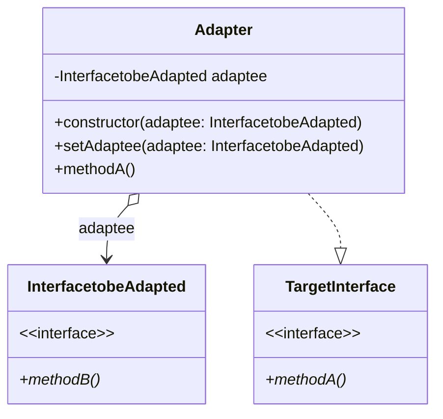

## 定义
将一个类的接口转换成用户所期待的。一个适配使得因接口不兼容而不能在一起工作的类能在一起工作
有继承和组合两种实现方式这里我们采用组合实现

## 类图


## c++实现
```cpp
#include <iostream>

using namespace std;

class HeatGenerator {
public:
  virtual void generateHeat() = 0;
};

class ElectricGenerator {
public:
  virtual void generateElectricity() = 0;
};

class Stove : public HeatGenerator {
public:
  void generateHeat() { cout << "Generating heat" << endl; }
};

class Heat2Electric : public ElectricGenerator {
public:
  Heat2Electric(HeatGenerator *adaptee) : adaptee(adaptee) {}
  void set_adaptee(HeatGenerator *adaptee) { this->adaptee = adaptee; }
  void generateElectricity() {
    adaptee->generateHeat();
    cout << "Converting heat to electric" << endl;
  }

private:
  HeatGenerator *adaptee;
};

class ElecticFan {
public:
  ElecticFan(ElectricGenerator *power) : power(power) {}
  void run() { cout << "Running electric fan" << endl; }

private:
  ElectricGenerator *power;
};

int main() {
  auto power = new Heat2Electric(new Stove());
  power->generateElectricity();
  auto fan = new ElecticFan(power);
  fan->run();
  return 0;
}
```

## 效果

**优点：**
- 可以让任何两个没有关联的类一起运行。 
- 提高了类的复用。 
- 增加了类的透明度。 
- 灵活性好。

**缺点：** 
- 过多地使用适配器，会让系统非常零乱，不易整体进行把握。比如，明明看到调用的是 A 接口，其实内部被适配成了 B 接口的实现，一个系统如果太多出现这种情况，无异于一场灾难。因此如果不是很有必要，可以不使用适配器，而是直接对系统进行重构。
